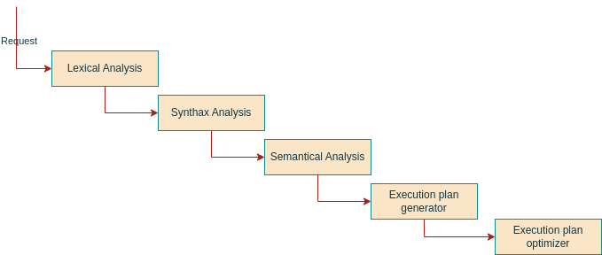

# Columnar
Columnar is a database managment system written in C and following the C90 standard.

It's a little concurrent system whose point is high performance over a single thread for data agregation queries using
an ANSI SQL compliant API.

## SQL interpreter structure


### Literrature

The understand the following lines, one might want to refer to the "Dragon book" as a compiler reference, and/or
the Stanford SOE.YCSCS1 Compiler course.

### 1. Lexical Analyser / Lexer / Tokenizer
 The goal of lexical analysis is to split the request into a collecton of elements of various types.

Example:

"
    SELECT A FROM B INNER JOIN C ON C.id_b = 3
    WHERE B.test == 10 OR B.test2 == blabla;
" :

```json
{
    "<lexeme>: "<token class>",
    "SELECT": "keyword",
    " ": "whitespace",
    "A": "identifier",
    " ": "whitespace",
    "FROM": "keyword",
    " ": "whitespace",
    "B" : "identifier",
    " ": "whitespace",
    "INNER": "keyword",
    " ": "whitespace",
    "JOIN": "keyword",
    " ": "whitespace",
    "C": "identifier",
    " ": "whitespace",
    "ON": "keywork",
    " ": "whitespace",
    "C.id_b" : "identifier",
    " ": "whitespace",
    "=" : "assignment_operator",
    " ": "whitespace",
    "3" : "integer",
    " ": "whitespace",
    "WHERE": "keyword",
    " ": "whitespace",
    "B.test": "identifier",
    " ": "whitespace",
    "==": "equality",
    " ": "whitespace",
    "10": "integer",
    " ": "whitespace",
    "OR": "keywork",
    " ": "whitespace",
    "B.test2": "identifier",
    " ": "whitespace",
    "==": "equality",
    " ": "whitespace",
    "blabla": "string",
    " ": "whitespace",
    ";": "semicolon"
}
```

To do so, it reads the string from left to right, and uses bounded lookahead. Reservered keywords help minimizing the
amount of lookahead, but it's still needed in some cases.

The principle of "Maximum munch is used" meaning when a the current buffer matches a token class, it keeps iterating
until meeting the end of the string or an element that doesn't match the token class.

The principle of priority ordering is used, meaning if a buffer matches multiple token classes regular expressions,
the highest priority token class will be declared.

To architect this Lexer, the following phases have been used :
- Define regular expressions for each token class of the language
- Define the non-deterministic finite automata
- Deduce the deterministic finte automata

#Non-deterministic finite automata schema
#Deterministic finite automata schema

We then store in memory the multi-dimentional array representing the set
of every edge (caracter permitting transition to the next state) and the next
state it goes to.

We then iterate on the input, and try to lex the whole thing.
If during the lecixal analysis, at a given state A, we are given a caracter
that doesn't match any edge, we consider the input not being part of the SQL
language, thus throw a Synthax Error.


### 2. Synthax Analyser / Parser

### 3. Semantical Analyser

### 4. Intermediate execution plan generator
 This phase's goal is the generate an execution plan from the elements understood in the previous phases.
 An execution plan is

### 5. Execution plan optimizer


# Compatibility
Columnar is only compatible with Linux over x86 patforms at the moment.

# Installation
## Using docker

## Using the source
```sh
# Get the source
git clone git@github.com:OlivierKessler01/columnar.git
# Compile the source
make
# Run the daemon
./columnar
```

# Contributing
This project is open to contributors, especially if you have some experience with concurrent C programming.

# Run the tests

# License


