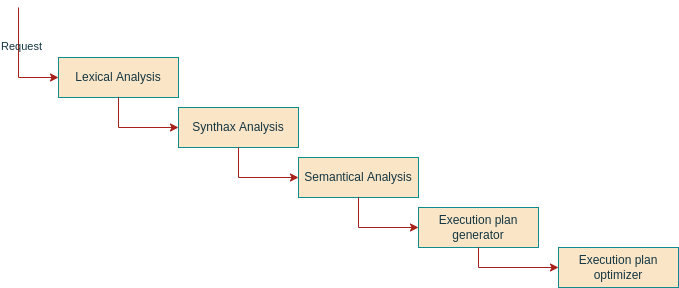

# Architecture

## Client/Server networking/OS specifics


## Data storage

In a old-school fashion, Columnar stores data mapping table columns to individual files
on local disk.
And doesn't use object storage, neither modern file formats like parquet.

Files layout for example table `Country` : 
| Id File  | 
| -------- |
| 1        | 
| 5        | 
| 6        |  
|.METADATA |

| Name file| 
| -------- |
| Portugal | 
| Spain    | 
| Cuba     |  
|.METADATA |

| Age file | 
| -------- |
| 122      | 
| 240      | 
| 1000     |  
|.METADATA |


Index file structure:
```
B-tree on disk
.METADATA_BLOCK
```


## SQL interpreter structure


### 1. Lexical Analyser / Lexer / Tokenizer / Scanner
 The goal of lexical analysis is to split the request into a collecton of elements of various types.

Example:

```sql
    SELECT A FROM B INNER JOIN C ON C.id_b = 3
    WHERE B.test == 10 OR B.test2 == blabla;
```

```json
{
    "<lexeme>": "<token class>",
    "SELECT": "keyword",
    " ": "whitespace",
    "A": "identifier",
    " ": "whitespace",
    "FROM": "keyword",
    " ": "whitespace",
    "B" : "identifier",
    " ": "whitespace",
    "INNER": "keyword",
    " ": "whitespace",
    "JOIN": "keyword",
    " ": "whitespace",
    "C": "identifier",
    " ": "whitespace",
    "ON": "keywork",
    " ": "whitespace",
    "C.id_b" : "identifier",
    " ": "whitespace",
    "=" : "assignment_operator",
    " ": "whitespace",
    "3" : "integer",
    " ": "whitespace",
    "WHERE": "keyword",
    " ": "whitespace",
    "B.test": "identifier",
    " ": "whitespace",
    "==": "equality",
    " ": "whitespace",
    "10": "integer",
    " ": "whitespace",
    "OR": "keywork",
    " ": "whitespace",
    "B.test2": "identifier",
    " ": "whitespace",
    "==": "equality",
    " ": "whitespace",
    "blabla": "string",
    " ": "whitespace",
    ";": "semicolon"
}
```

To do so, it reads the string from left to right, and uses bounded lookahead. Reservered keywords help minimizing the
amount of lookahead, but it's still needed in some cases.

The principle of "Maximum munch is used" meaning when a the current buffer matches a token class, it keeps iterating
until meeting the end of the string or an element that doesn't match the token class.

The principle of priority ordering is used, meaning if a buffer matches multiple token classes regular expressions,
the highest priority token class will be declared.

To architect this Lexer generator, the following phases have been used :

- Define regular expressions for each token class of the language
- Run the Thompson construction to convert the regexp to a non-deterministic finite automaton
- Convert the NFA to DFA using the "subset construction"
- Minimize the DFA
- Generate the scanner C code from the DFA

Once the scanner C code is there, you can simply link it and call it. It will return 
an array of tuples (lexeme, category).

This you can feed to the parser.

#### **Non-deterministic finite automata ecample**


#### **Deterministic finite automata schema**


We then store in memory the multi-dimentional array representing the set
of every edge (caracter permitting transition to the next state) and the next
state it goes to.

We then iterate on the input, and try to lex the whole thing.
If during the lecixal analysis, at a given state A, we are given a caracter
that doesn't match any edge, we consider the input not being part of the SQL
language, thus throw a Synthax Error.


### 2. Synthax Analyser / Parser

### 3. Semantical Analyser

### 4. Intermediate execution plan generator
 This phase's goal is the generate an execution plan from the elements understood in the previous phases.

### 5. Execution plan optimizer

### 6. Run the execution plan

